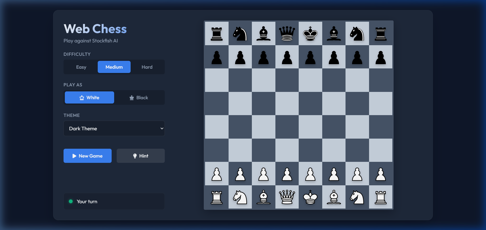
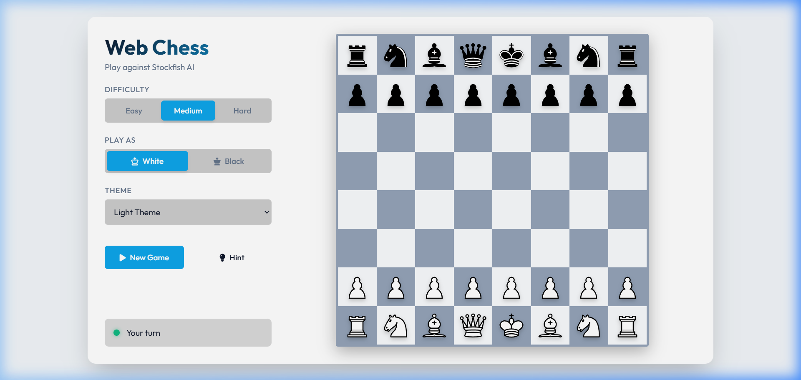

# Web Chess

A fully functional, responsive, and beautiful web-based chess game built with vanilla HTML, CSS, and JavaScript. Play against the powerful Stockfish AI directly in your browser.

## Features

- **Stockfish AI Integration:** Play against one of the strongest chess engines in the world, running locally in your browser via Web Workers.
- **Multiple Difficulties:** Choose between Easy, Medium, and Hard skill levels to match your play style.
- **Player Side Selection:** Choose to play as White or Black. The board automatically flips to your perspective.
- **Dynamic Theming:** Switch seamlessly between Dark, Light, Blue, and Red themes to customize your visual experience.
- **Hint System:** Stuck on a move? Use the Hint button to ask Stockfish for the best move, which will pulse green directly on the board.
- **Valid Move Highlighting:** See all legal moves for a selected piece, powered by `chess.js`.
- **Social Sharing:** Share your victories on X (Twitter) with a single click after a checkmate.
- **Responsive Design:** Play comfortably on desktop, tablet, or mobile devices using a modern CSS Grid layout.
- **High-Quality Graphics:** Uses standard public domain SVG pieces from Wikimedia Commons for crisp, scalable rendering.

## Technical Stack

- **Frontend:** Vanilla HTML5, CSS3 (CSS Variables, Grid, Flexbox), and ES6 JavaScript. No heavy frontend frameworks required.
- **Game Logic:** powered by [chess.js](https://github.com/jhlywa/chess.js), handling all complex chess rules like en passant, castling, and draw detection.
- **AI Engine:** powered by compiled [stockfish.js](https://github.com/nmrugg/stockfish.js), running off the main thread to ensure the UI remains buttery smooth.

## How to Run Locally

You don't need any build tools or local servers to run this project. Simply:

1. Clone or download this repository.
2. Open `index.html` in any modern web browser.
3. Start playing!

*Note: Since Stockfish runs in a Web Worker, some strict browsers might block it if opened directly via the `file://` protocol. If the bot doesn't move, serve the folder through a simple local HTTP server (e.g., `npx http-server` or Python's `python -m http.server`).*

## Acknowledgments

- Built using the Antigravity IDE with the Gemini 3.1 Pro (High) model.
- Pieces provided by [Wikimedia Commons](https://commons.wikimedia.org/wiki/Category:SVG_chess_pieces).
